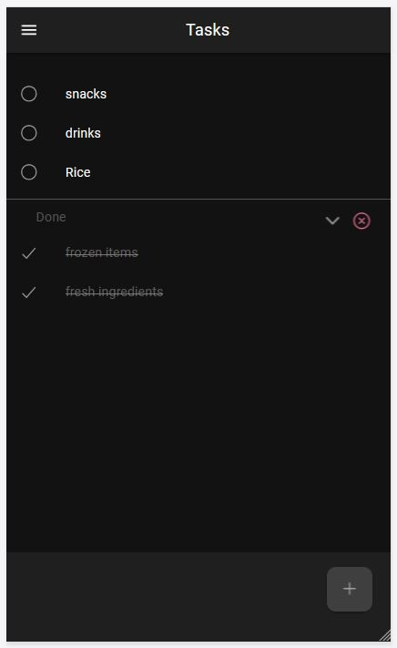
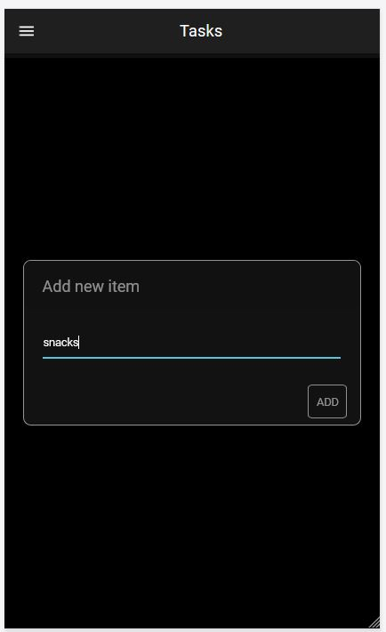
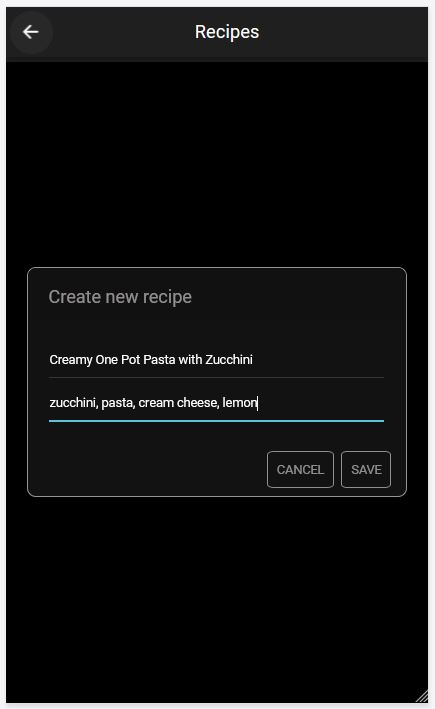
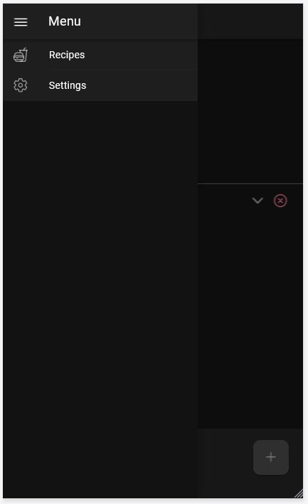
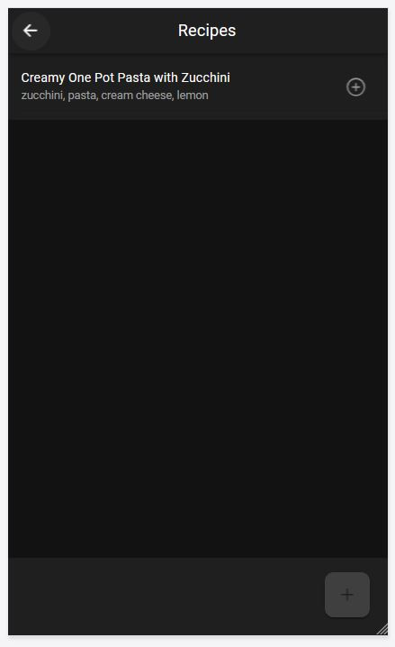
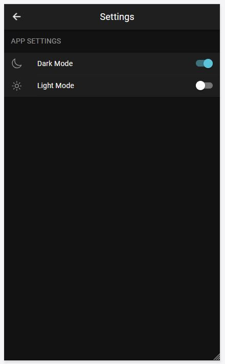
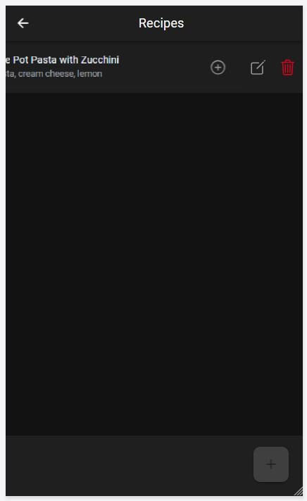

# ShoppingListApp

Die **ShoppingListApp** ist eine einfache, intuitive Einkaufslisten-App, mit der man Einkäufe schnell organisieren kannst.  
Du kannst neue Artikel hinzufügen, abhaken, bearbeiten oder löschen – und sogar eigene Rezepte mit Zutaten speichern, die direkt in die Einkaufsliste übernommen werden können. 

Hier ein Beispielbild der App-Oberfläche:

